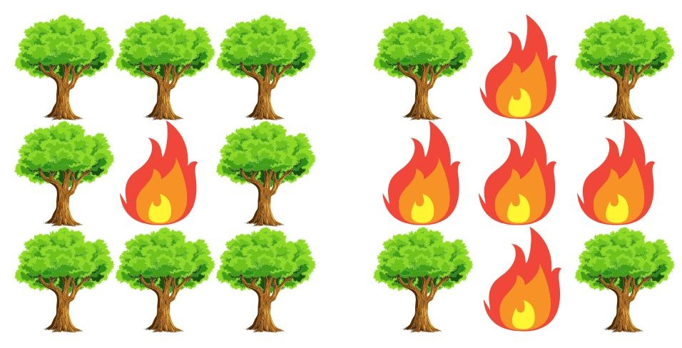

<h1> 🔥README DO SIMULADOR DE INCENDIO🔥</h1>

- **Aluno:** Heitor Henrique Zonho
- **Professor:** Michel Pires da Silva  
- **Disciplina:** Algoritmos e Estruturas de Dados I  

---

## Introdução

Este trabalho exemplifica a propagacao de um incendio em uma  floresta, levando em consideracao a direcao do vento e tambem possui a simulacao de um animal fugindo fogo. 




---

## **Objetivo**  
Fornecer uma ferramenta para:  
- Exemplificar a propagacao do fogo em uma floresta.  
- Simular a fuga de um animal nessa floresta.  
- Estudar o impacto de escolhas algorítmicas no desempenho computacional.  

---

## **Funcionalidades Principais**  
1. **Matriz Dinâmica**  
   - Representa a floresta com células de estados variados:  
     - `0`: Área segura (não queima)  
     - `1`: Árvore saudável  
     - `2`: Fogo ativo  
     - `3`: Árvore queimada  
     - `4`: Água (converte células adjacentes para arvores saudaveis)

2. **Propagação Realista do Fogo**  
   - Direções configuráveis do vento (`Config.hpp`).  
   - Atualização iterativa com duas matrizes para evitar conflitos de estado.  

3. **Movimentação Inteligente do Animal**  
   - Prioriza rotas seguras: `Água (4) > Vazio (0) > Árvore saudável (1) > Queimada (3)`.  
   - **Segunda chance:** Se atingido pelo fogo, tenta escapar novamente.  

4. **Entrada/Saída de Dados**  
   - Leitura de cenários via `input.dat`.  
   - Geração de logs detalhados em `output.dat`, incluindo:  
     - Posição do animal (`A`) em cada iteração.  
     - Estatísticas finais (passos, sobrevivência, etc.).  

---

## Metadologia

Em cada ciclo:

1. `andarAnimal()`
2. vrificar se o animal esta numa celula segura.
3. `espalharFogo()`
4. se o animal ficou em célula em chamas, chamar `andaranimal()` denovo.
<details> 
  <summary><strong>Clique para ver o Fluxograma</strong></summary>


  </details>
---

## Arquivo de Configuração (`Config.hpp`)
<details>
  <summary><strong>Mostrar config.hpp</strong></summary>
  
```cpp
class Config
{
    private:

    int interacoes=1000;
    char vento='0';

    public:

    int getInteracoes();
    void setInteracoes(int interacoes);
    char getVento();
    void setVento(char vento);
};
```

- 'interacoes' determina o numero de interacoes.  
- 'vento' define a direcao do vento:
``` 
   -'0' para todas as direcoes ortogonais.  
   -'D' para a direita.
   -'E' para a esquerda.
   -'C' para cima.
   -'B' para baixo.
```   
---
</details>

## Arquivos de Funcoes (`Funcoes.hpp` e `Funcoes.cpp`)
<details>
  <summary><strong>Mostrar Funcoes.hpp</strong></summary>

  ```
    #ifndef FUNCOES_HPP
#define FUNCOES_HPP

#include <iostream>
#include <fstream>
#include <string>
#include <vector>

using namespace std;

class Funcoes 
{
    private:

    int linhas;
    int colunas;
    int posicaoInicialFX;
    int posicaoInicialFY;
    vector<std::vector<int>> matriz;
    vector<std::vector<bool>> visitados;
    public:
    
    void lerArquivo();
    int getPX();
    void setPX(int i);
    int getPY();
    void setPY(int j);
    vector<std::vector<int>> getMatriz(); 
    void setMatriz(vector<vector<int>>& novaMatriz);
    int getLinhas();
    int getColunas();
    void setVisitados(vector<std::vector<bool>> visitados);
    vector<std::vector<bool>>& getVisitados();
    void printArquivo(vector<std::vector<int>> matriz);
    void printArquivoComAnimal(vector<vector<int>> matriz, int animalX, int animalY, ofstream& arquivoSaida);
    void printFinal(int iteracao, int passos, int vivo);
};
#endif 
  ```

 </details> 
 <details>
  <summary><strong>Mostrar Funcoes.cpp</strong></summary>

  ```
#include "Funcoes.hpp"
#include "Floresta.hpp"

void Funcoes::lerArquivo()
{
    ifstream arquivo("data/input.dat");

        if(!arquivo.is_open())
        {
          cerr<<"Erro ao abrir o arquivo 'input.dat'"<<endl;
          return;
        }

        int m,n,fogoInicialL,fogoInicialC;
        arquivo>>m>>n>>fogoInicialL>>fogoInicialC;

        cout << "m: " << m << ", n: " << n << ", L: " << fogoInicialL << ", C: " << fogoInicialC << endl;

        vector<vector<int>> matriz(m, vector<int>(n));

        for(int i =0;i<m;i++)
        {
          for(int j=0;j<n;j++)
          {
            arquivo>>matriz[i][j];
          }
        }

        this->posicaoInicialFX=fogoInicialL;
        this->posicaoInicialFY=fogoInicialC;
        this->linhas=m;
        this->colunas=n;
        this->matriz=matriz;

        for(int i =0;i<m;i++)
        {
          for(int j=0;j<n;j++)
          {
            cout<<matriz[i][j]<<" ";
          }
          cout<<endl;
        }
        vector<vector<bool>> aux(m, vector<bool>(n));
        this->setVisitados(aux);
}
 
int Funcoes::getPX()
{
  return posicaoInicialFX;
}

void Funcoes::setPX(int i)
{
  this->posicaoInicialFX=i;
}

int Funcoes::getPY()
{
  return posicaoInicialFY;
}

void Funcoes::setPY(int j)
{
  this->posicaoInicialFY=j;
}
vector<std::vector<int>> Funcoes::getMatriz()
{
  return matriz;
}
void Funcoes::setMatriz(vector<vector<int>>& novaMatriz)
{
  this->matriz=novaMatriz;
}
void Funcoes::setVisitados(vector<std::vector<bool>> visitados)
{
  this->visitados=visitados;
}
vector<std::vector<bool>>& Funcoes::getVisitados()
{
  return visitados;
}
void Funcoes::printArquivoComAnimal(vector<vector<int>> matriz, int animalX, int animalY, ofstream& arquivoSaida) 
{
    // Garante que o buffer seja liberado
    arquivoSaida << std::flush;
    
    for (int i = 0; i < linhas; i++) 
    {
        for (int j = 0; j < colunas; j++) 
        {
            if (i == animalX && j == animalY) 
            {
                arquivoSaida << "A ";
            } 
            else 
            {
                arquivoSaida << matriz[i][j] << " ";
            }
        }
        arquivoSaida << endl;
    }
    arquivoSaida << endl << std::flush;  // Força a escrita no arquivo
}
int Funcoes::getLinhas()
{
  return linhas;
}
int Funcoes::getColunas()
{
  return colunas;
}
void Funcoes::printFinal(int iteracao, int passos, int vivo)
{
  cout<<"Passos:"<<passos<<endl;
  cout<<"Interacoes:"<<iteracao<<endl;
  if(vivo==1)
  {
    cout<<"Estado do animal: Vivo"<<endl;
  }
  else
  {
    cout<<"Estado do animal: Morto"<<endl;
  }
}
  ```
 </details> 
 
 - Possui  variaveis para armazenar o numero de linhas e colunas, a matriz , a posicao inicial do  Fogo e uma matriz de visitados.
 - Realiza o trabalho de ler o arquivo 'input.dat' e gerar o arquivo de saida 'output.dat'.


## Classe `Floresta` (`Floresta.hpp` / `Floresta.cpp`)

### Variáveis principais

- `matriz` e `visitados` : Armazena a matriz  e os lugares visitados pelo animal.
- `posicaoInicialFX` e `PosicaoInicialFY` : Armazena o foco inicial do incendio.
- `animalX` e `animalY` : Armazena a posicao atual do animal.

### Construtor
<details>
  <summary><strong>Mostrar construtor </strong></summary>

```cpp
Floresta::Floresta(int linhas, int colunas, int posicaoInicialFX,int posicaoInicialFY, vector<std::vector<int>> matriz, vector<std::vector<bool>>& visitados)
{
    this->linhas=linhas;
    this->colunas=colunas;
    this->posicaoInicialFX=posicaoInicialFX;
    this->posicaoInicialFY=posicaoInicialFY;
    this->matriz=matriz;
    acharPosicaoInicial();
    visitados[animalX][animalY]=true;
    this->visitados=visitados;
}
```
 </details>

- Atribui os valores para linhas e colunas da matriz.
- Atribui valores para a posicaoInicialFX e posicaoInicialFY(posicao inicial do fogo).
- Atribui a matriz lida do arquivo ao atributo e tambem cria a matriz de visitador marcando a posicao inicial do animal como true.

---

### `andarAnimal()`

<details>
  <summary><strong>Mostrar andarAnimal()</strong></summary>

```cpp
void Floresta::andarAnimal() 
{
    if (!vivo) return;

    vector<pair<int, int>> direcoes = {{-1,0}, {1,0}, {0,-1}, {0,1}};

    auto buscarOpcoes = [&](int valorAlvo) 
    {
        vector<pair<int, int>> naoVisitadas, visitadas;
        for (auto& dir : direcoes) 
        {
            int x = animalX + dir.first;
            int y = animalY + dir.second;
            if (x >= 0 && x < linhas && y >= 0 && y < colunas && matriz[x][y] == valorAlvo) 
            {
                if (!visitados[x][y]) naoVisitadas.push_back({x, y});
                else visitadas.push_back({x, y});
            }
        }
        return !naoVisitadas.empty() ? naoVisitadas : visitadas;
    };

    vector<pair<int, int>> opcoes;

    
    opcoes = buscarOpcoes(4);
    if (opcoes.empty()) 
    {
        
        opcoes = buscarOpcoes(0);
    }
    if (opcoes.empty()) 
    {
        
        opcoes = buscarOpcoes(1);
    }
    if (opcoes.empty()) 
    {
        opcoes = buscarOpcoes(3);
    }

    if (!opcoes.empty()) 
    {
        // Move para a primeira opção válida 
        animalX = opcoes[0].first;
        animalY = opcoes[0].second;
        visitados[animalX][animalY] = true; // Marca nova posição como visitada
        passos++;

        // Lógica de água 
        if (matriz[animalX][animalY] == 4) 
        {
            encontrouAgua++;
            matriz[animalX][animalY] = 0;
            // Atualiza adjacentes
            if (animalX - 1 >= 0) matriz[animalX - 1][animalY] = 1;
            if (animalX + 1 < linhas) matriz[animalX + 1][animalY] = 1;
            if (animalY - 1 >= 0) matriz[animalX][animalY - 1] = 1;
            if (animalY + 1 < colunas) matriz[animalX][animalY + 1] = 1;
        }
    } 
    else 
    {
        vivo = false;
        iteracaoPreso = passos;
    }
}
```
</details>

- Segue a prioridade 4>0>1>3 .
- Atualiza as celulas ao redor do animal para 1 quando encontra uma celula com agua.
- Conta o numero de passos do animal.

---

### `espalharFogo()`

<details>
  <summary><strong>Mostrar espalharFogo()</strong></summary>

```cpp
void Floresta::espalharFogo(char vento)
{
    vector<vector<int>> novaMatriz = matriz; // cópia temporária para evitar propagação incorreta

    for (int i = 0; i < linhas; i++) 
    {
        for (int j = 0; j < colunas; j++) 
        {
            if (matriz[i][j] == 2) 
            {
                // Sem vento
                if (vento == '0') 
                {
                    if (i + 1 < linhas && matriz[i + 1][j] == 1) 
                    {
                        novaMatriz[i + 1][j] = 2;
                        cout << "(" << i + 1 << "," << j << ") vira 2 (abaixo)" << endl;
                    }
                    if (i - 1 >= 0 && matriz[i - 1][j] == 1) 
                    {
                        novaMatriz[i - 1][j] = 2;
                        cout << "(" << i - 1 << "," << j << ") vira 2 (acima)" << endl;
                    }
                    if (j + 1 < colunas && matriz[i][j + 1] == 1) 
                    {
                        novaMatriz[i][j + 1] = 2;
                        cout << "(" << i << "," << j + 1 << ") vira 2 (direita)" << endl;
                    }
                    if (j - 1 >= 0 && matriz[i][j - 1] == 1) 
                    {
                        novaMatriz[i][j - 1] = 2;
                        cout << "(" << i << "," << j - 1 << ") vira 2 (esquerda)" << endl;
                    }
                }
                // Vento para cima
                else if (vento == 'C') 
                {
                    if (i - 1 >= 0 && matriz[i - 1][j] == 1) 
                    {
                        novaMatriz[i - 1][j] = 2;
                        cout << "(" << i - 1 << "," << j << ") vira 2 (acima)" << endl;
                    }
                }
                // Vento para baixo
                else if (vento == 'B') 
                {
                    if (i + 1 < linhas && matriz[i + 1][j] == 1) 
                    {
                        novaMatriz[i + 1][j] = 2;
                        cout << "(" << i + 1 << "," << j << ") vira 2 (abaixo)" << endl;
                    }
                }
                // Vento para esquerda
                else if (vento == 'E') 
                {
                    if (j - 1 >= 0 && matriz[i][j - 1] == 1) 
                    {
                        novaMatriz[i][j - 1] = 2;
                        cout << "(" << i << "," << j - 1 << ") vira 2 (esquerda)" << endl;
                    }
                }
                // Vento para direita
                else if (vento == 'D') 
                {
                    if (j + 1 < colunas && matriz[i][j + 1] == 1) 
                    {
                        novaMatriz[i][j + 1] = 2;
                        cout << "(" << i << "," << j + 1 << ") vira 2 (direita)" << endl;
                    }
                }

                // A árvore atual em chamas vira queimada
                novaMatriz[i][j] = 3;
            }
        }
    }

    // Atualiza a matriz real
    matriz = novaMatriz;
}
```
 </details>

 - Espalha o fogo de acordo com a direcao do vento definida no 'config.hpp'.
 - Utiliza uma matriz auxiliar para nao espalhar o fogo indefinidamente.
---

## Loop Principal (`main.cpp`)

<details>
  <summary><strong>Mostrar main.cpp</strong></summary>

```cpp
int main()
{
    Funcoes funcoes;
    Config config;
    funcoes.lerArquivo();
    Floresta* floresta = new Floresta(funcoes.getLinhas(), funcoes.getColunas(), funcoes.getPX(), funcoes.getPY(), funcoes.getMatriz(),funcoes.getVisitados());
    string nomeArquivo="output.dat";

    ofstream arquivoSaida(nomeArquivo);

    if (!arquivoSaida.is_open()) 
    {
        cerr << "Erro ao abrir o arquivo de saída!" << endl;
        return 1;
    }

    streambuf* coutBuffer = cout.rdbuf();
    cout.rdbuf(arquivoSaida.rdbuf());

    floresta->acharPosicaoInicial();
    int iteracao = 0;
    while (floresta->temFogo() && iteracao < config.getInteracoes()) 
    {
        arquivoSaida << "=== Iteração " << iteracao << " ===" << endl;

        
        floresta->andarAnimal();
        arquivoSaida << "\nPosição do animal: (" << floresta->getAnimalX() << "," << floresta->getAnimalY() << ")\n";
        funcoes.printArquivoComAnimal(floresta->getMatriz(), floresta->getAnimalX(), floresta->getAnimalY(), arquivoSaida);
        if(floresta->getMatriz()[floresta->getAnimalX()][floresta->getAnimalY()] == 0)
        {
            for(int i=0;i<3;i++)
            {                
                cout<<"Animal descansando"<<endl;
                floresta->espalharFogo(config.getVento());
                funcoes.printArquivoComAnimal(floresta->getMatriz(), floresta->getAnimalX(), floresta->getAnimalY(), arquivoSaida);
                iteracao++;
            }
        }
        else
        {
            streambuf* originalCoutBuffer = cout.rdbuf(); 
            cout.rdbuf(arquivoSaida.rdbuf());
            floresta->espalharFogo(config.getVento());
            cout.rdbuf(originalCoutBuffer);
            iteracao++;
        }
        
        if (!floresta->segundaChance()) 
        {
            arquivoSaida << "[FIM] Animal preso na iteração " << iteracao << endl;
            break;
        }
                
        funcoes.printArquivoComAnimal(floresta->getMatriz(), floresta->getAnimalX(), floresta->getAnimalY(), arquivoSaida);

    }
    funcoes.printFinal(iteracao,floresta->getPassos(), floresta->getVivo());
    cout.rdbuf(coutBuffer);
    arquivoSaida.close();
    delete floresta;
    return 0;
}
```
</details>

- Determina as interacoes e faz com que o animal fique 3 interacoes parado em pontos seguros '0'.

---

## Estrutura do projeto

```
include/
  Config.hpp
  Floresta.hpp
  Funcoes.hpp

src/
  Config.cpp
  Floresta.cpp
  Funcoes.cpp
  main.cpp

data/
  input.dat
  
output.dat
Makefile
```

---

## Movimentação do Animal

1. **Água (4):** prioridade máxima — reseta célula para 0 e torna as celulas ao redor 1.  
2. **Seguro (0 ou 1):** prioriza o 0 depois o 1, ambas mantem o animal seguro,porem a celula 1 queima; espera até 3 iterações em 0 para estabilidade.  
3. **Queimado (3):** última opção, caso não haja mais alternativas.  
4. **Impossibilitado:** Qualquer outro caso o animal sera marcado como morto`Vivo`=false.

---

## Segunda Chance

Se depois do fogo ser espalhado por `espalharFogo()` o animal estiver em uma celula marcado como `2`, sera acionada a segunda chance , ou seeja, faz o animal se mover denovo `andarAnimal()`, e caso ainda assim estar em uma celula marcada como 2, ele sera marcado como morto.

---

## Representação Visual do Incêndio

- **Sem vento ou com vento em todas direções:** fogo em todas as ortogonais.  
- **Vento seletivo:** respeita o vento no config.hpp , sendo 1 para sim naquela direcao e 0 para nao,caso for 4 zeros sera para todas as direcoes assim como 1 em todas as direcoes.

---

## Casos de Teste

### Caso 1: Propagação sem vento (todas as direções)

**input.dat**
```
5 5 1 1
1 1 1 1 4
1 2 1 1 1
1 1 1 1 4
0 0 1 1 1
1 4 1 0 4
```

**output.dat (resumo)**
- O fogo se propaga em todas as direcoes.
- O animal comeca em (3,0).
- Da 2 passos em um total de 6 interacoes e termina vivo.
<details>
  <summary><strong>Mostrar output.dat completo</strong></summary>

```
=== Iteração 0 ===

Posição do animal: (3,1)
1 1 1 1 4 
1 2 1 1 1 
1 1 1 1 4 
0 A 1 1 1 
1 4 1 0 4 

Animal descansando
(2,1) vira 2 (abaixo)
(0,1) vira 2 (acima)
(1,2) vira 2 (direita)
(1,0) vira 2 (esquerda)
1 2 1 1 4 
2 3 2 1 1 
1 2 1 1 4 
0 A 1 1 1 
1 4 1 0 4 

Animal descansando
(0,2) vira 2 (direita)
(0,0) vira 2 (esquerda)
(2,0) vira 2 (abaixo)
(0,0) vira 2 (acima)
(2,2) vira 2 (abaixo)
(0,2) vira 2 (acima)
(1,3) vira 2 (direita)
(2,2) vira 2 (direita)
(2,0) vira 2 (esquerda)
2 3 2 1 4 
3 3 3 2 1 
2 3 2 1 4 
0 A 1 1 1 
1 4 1 0 4 

Animal descansando
(0,3) vira 2 (direita)
(2,3) vira 2 (abaixo)
(0,3) vira 2 (acima)
(1,4) vira 2 (direita)
(3,2) vira 2 (abaixo)
(2,3) vira 2 (direita)
3 3 3 2 4 
3 3 3 3 2 
3 3 3 2 4 
0 A 2 1 1 
1 4 1 0 4 

3 3 3 2 4 
3 3 3 3 2 
3 3 3 2 4 
0 A 2 1 1 
1 4 1 0 4 

=== Iteração 3 ===

Posição do animal: (4,1)
3 3 3 2 4 
3 3 3 3 2 
3 3 3 2 4 
0 1 2 1 1 
1 A 1 0 4 

Animal descansando
(3,3) vira 2 (abaixo)
(4,2) vira 2 (abaixo)
(3,3) vira 2 (direita)
(3,1) vira 2 (esquerda)
3 3 3 3 4 
3 3 3 3 3 
3 3 3 3 4 
0 2 3 2 1 
1 A 2 0 4 

Animal descansando
(3,4) vira 2 (direita)
3 3 3 3 4 
3 3 3 3 3 
3 3 3 3 4 
0 3 3 3 2 
1 A 3 0 4 

Animal descansando
3 3 3 3 4 
3 3 3 3 3 
3 3 3 3 4 
0 3 3 3 3 
1 A 3 0 4 

3 3 3 3 4 
3 3 3 3 3 
3 3 3 3 4 
0 3 3 3 3 
1 A 3 0 4 

Passos:2
Interacoes:6
Estado do animal: Vivo


```
</details> 


---

### Caso 2: Propagação com vento (somente para a esquerda)

**input.dat**
```
6 6 2 2
1 1 2 1 1 1
1 1 1 1 1 1
1 1 1 1 1 1
0 1 1 4 1 1
1 1 1 1 1 1
1 1 1 1 1 1
```

**output.dat (resumo)**
- Vento configurado no config.hpp para ir so pra esquerda.
- Animal inicia em (3,0).
- Da 2 passos em um total de 4 interacoes e termina vivo.
<details>
  <summary><strong>Mostrar output.dat completo</strong></summary>

```
=== Iteração 0 ===

Posição do animal: (2,0)
1 1 2 1 1 1 
1 1 1 1 1 1 
A 1 1 1 1 1 
0 1 1 4 1 1 
1 1 1 1 1 1 
1 1 1 1 1 1 

(0,1) vira 2 (esquerda)
1 2 3 1 1 1 
1 1 1 1 1 1 
A 1 1 1 1 1 
0 1 1 4 1 1 
1 1 1 1 1 1 
1 1 1 1 1 1 

=== Iteração 1 ===

Posição do animal: (3,0)
1 2 3 1 1 1 
1 1 1 1 1 1 
1 1 1 1 1 1 
A 1 1 4 1 1 
1 1 1 1 1 1 
1 1 1 1 1 1 

Animal descansando
(0,0) vira 2 (esquerda)
2 3 3 1 1 1 
1 1 1 1 1 1 
1 1 1 1 1 1 
A 1 1 4 1 1 
1 1 1 1 1 1 
1 1 1 1 1 1 

Animal descansando
3 3 3 1 1 1 
1 1 1 1 1 1 
1 1 1 1 1 1 
A 1 1 4 1 1 
1 1 1 1 1 1 
1 1 1 1 1 1 

Animal descansando
3 3 3 1 1 1 
1 1 1 1 1 1 
1 1 1 1 1 1 
A 1 1 4 1 1 
1 1 1 1 1 1 
1 1 1 1 1 1 

3 3 3 1 1 1 
1 1 1 1 1 1 
1 1 1 1 1 1 
A 1 1 4 1 1 
1 1 1 1 1 1 
1 1 1 1 1 1 

Passos:2
Interacoes:4
Estado do animal: Vivo

```
</details> 

---

### Caso 3: Animal preso pelo fogo

**input.dat**
```
4 4 0 0
2 1 1 1
1 1 1 1
1 1 1 1
0 1 1 1
```

**output.dat (resumo)**
- O animal comeca no (3,0).
- Da 4 passos em um total de 8 interacoes e termina vivo.
- Animal termina com apenas opcoees terriveis para se mover.
<details>
  <summary><strong>Mostrar output.dat completo</strong></summary>

```
=== Iteração 0 ===

Posição do animal: (2,0)
2 1 1 1 
1 1 1 1 
A 1 1 1 
0 1 1 1 

(1,0) vira 2 (abaixo)
(0,1) vira 2 (direita)
3 2 1 1 
2 1 1 1 
A 1 1 1 
0 1 1 1 

=== Iteração 1 ===

Posição do animal: (3,0)
3 2 1 1 
2 1 1 1 
1 1 1 1 
A 1 1 1 

Animal descansando
(1,1) vira 2 (abaixo)
(0,2) vira 2 (direita)
(2,0) vira 2 (abaixo)
(1,1) vira 2 (direita)
3 3 2 1 
3 2 1 1 
2 1 1 1 
A 1 1 1 

Animal descansando
(1,2) vira 2 (abaixo)
(0,3) vira 2 (direita)
(2,1) vira 2 (abaixo)
(1,2) vira 2 (direita)
(2,1) vira 2 (direita)
3 3 3 2 
3 3 2 1 
3 2 1 1 
A 1 1 1 

Animal descansando
(1,3) vira 2 (abaixo)
(2,2) vira 2 (abaixo)
(1,3) vira 2 (direita)
(3,1) vira 2 (abaixo)
(2,2) vira 2 (direita)
3 3 3 3 
3 3 3 2 
3 3 2 1 
A 2 1 1 

3 3 3 3 
3 3 3 2 
3 3 2 1 
A 2 1 1 

=== Iteração 4 ===

Posição do animal: (2,0)
3 3 3 3 
3 3 3 2 
A 3 2 1 
0 2 1 1 

(2,3) vira 2 (abaixo)
(3,2) vira 2 (abaixo)
(2,3) vira 2 (direita)
(3,2) vira 2 (direita)
3 3 3 3 
3 3 3 3 
A 3 3 2 
0 3 2 1 

=== Iteração 5 ===

Posição do animal: (3,0)
3 3 3 3 
3 3 3 3 
3 3 3 2 
A 3 2 1 

Animal descansando
(3,3) vira 2 (abaixo)
(3,3) vira 2 (direita)
3 3 3 3 
3 3 3 3 
3 3 3 3 
A 3 3 2 

Animal descansando
3 3 3 3 
3 3 3 3 
3 3 3 3 
A 3 3 3 

Animal descansando
3 3 3 3 
3 3 3 3 
3 3 3 3 
A 3 3 3 

3 3 3 3 
3 3 3 3 
3 3 3 3 
A 3 3 3 

Passos:4
Interacoes:8
Estado do animal: Vivo

```
</details> 

---

### Caso 4: Interrupção por limite de iterações (MaxIteracoes = 3)

**input.dat**
```
4 4 0 0
2 1 1 1
1 1 1 1
1 1 1 1
0 1 1 1
```

**output.dat (resumo)**
- Demonstra o limite de interacoes definido no config.hpp.
- Da 2 passos em um total de 3 interacoes e termina vivo.

<details>
  <summary><strong>Mostrar output.dat completo</strong></summary>

```
=== Iteração 0 ===

Posição do animal: (2,0)
2 1 1 1 
1 1 1 1 
A 1 1 1 
0 1 1 1 

(1,0) vira 2 (abaixo)
(0,1) vira 2 (direita)
3 2 1 1 
2 1 1 1 
A 1 1 1 
0 1 1 1 

=== Iteração 1 ===

Posição do animal: (3,0)
3 2 1 1 
2 1 1 1 
1 1 1 1 
A 1 1 1 

Animal descansando
(1,1) vira 2 (abaixo)
(0,2) vira 2 (direita)
(2,0) vira 2 (abaixo)
(1,1) vira 2 (direita)
3 3 2 1 
3 2 1 1 
2 1 1 1 
A 1 1 1 

Animal descansando
(1,2) vira 2 (abaixo)
(0,3) vira 2 (direita)
(2,1) vira 2 (abaixo)
(1,2) vira 2 (direita)
(2,1) vira 2 (direita)
3 3 3 2 
3 3 2 1 
3 2 1 1 
A 1 1 1 

3 3 3 2 
3 3 2 1 
3 2 1 1 
A 1 1 1 

Passos:2
Interacoes:3
Estado do animal: Vivo

```
</details> 

---
---
## Conclusão
### Ideias de Melhoria 

- Implementar uma interface grafica.
- Possibilidade de implementacao de algoritmos mais eficientes.


---

## Compilação

Requisitos: Linux, `g++` (C++17), `make`

```bash
make clean
make
make run
```

---

## Autor

- Heitor Henrique Zonho
